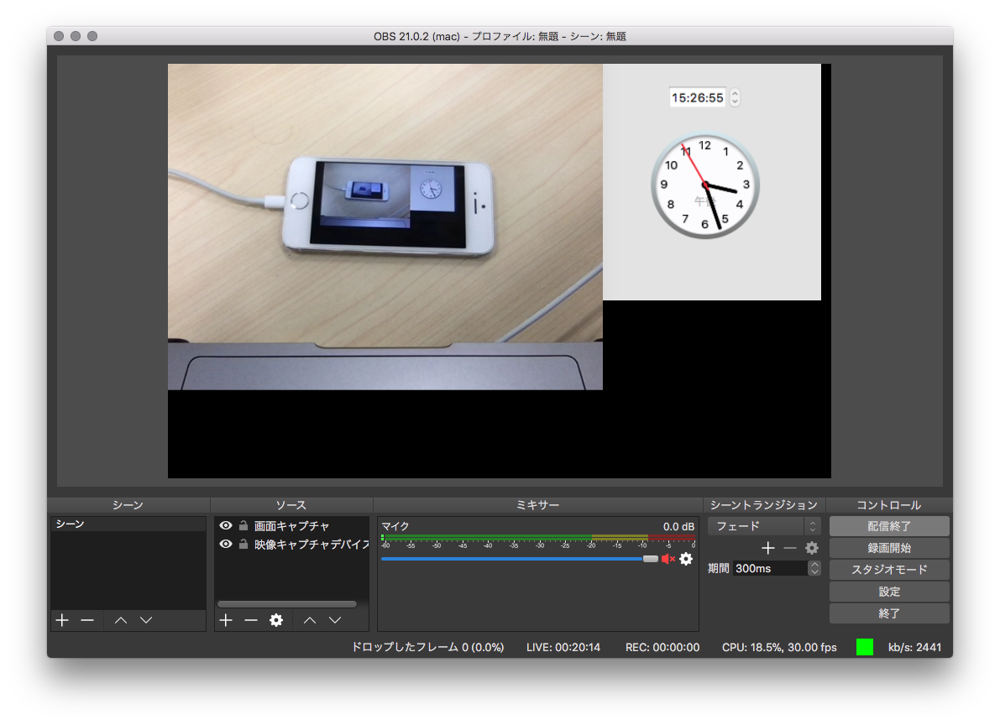
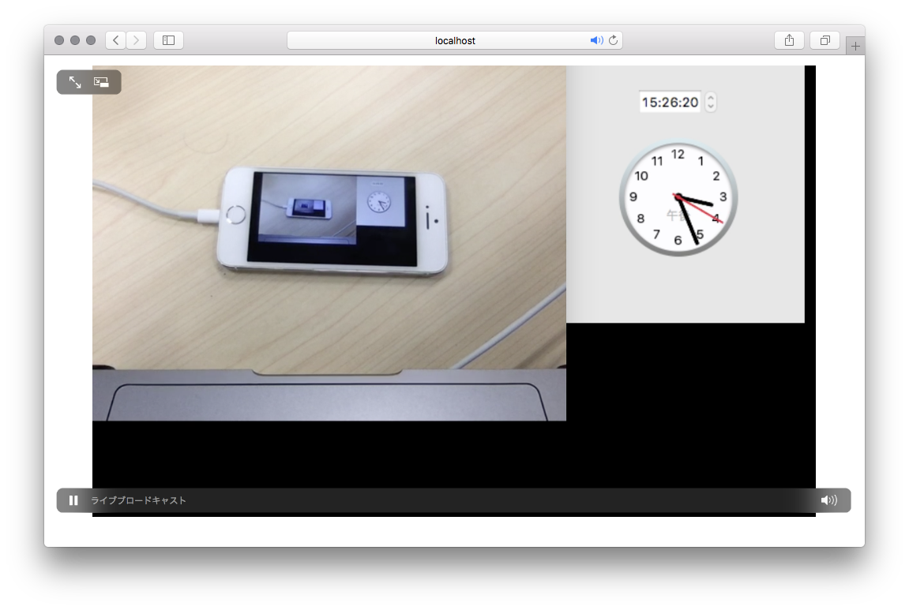

# Nginx + nginx-rtmp-module

動画配信を試すために, まずは Nginx + rtmp モジュールで環境を構築する.

## 参考
* [フロントエンドエンジニアのための生放送と RTMP 通信基礎](https://ygoto3.com/posts/live-streaming-and-rtmp-for-frontend-engineers/)
* [nginx-rtmp-moduleを使ってスマートフォンへの生放送配信を実験](https://qiita.com/oggata/items/5933e9a5ab16ece45c5f)

## メディアサーバ
タイトルの通り, 今回は [Nginx](https://nginx.org/en/) と [nginx-rtmp-module](https://github.com/arut/nginx-rtmp-module) を用いる.

### Build
[Dockerfile](docker/Dockerfile) をビルドする.

```
$ cd docker
$ make
```

### serve

```
$ ./serve.sh
```

### nginx.conf
* ポート `1935` で待受け
* application: `live`

```
(略)
rtmp {
  server {
    listen 1935;
    chunk_size 4096;

    application live {
      live on;
      hls on;

      hls_path /usr/share/nginx/html/hls;
      hls_fragment 1s;
      hls_type live;
    }
  }
}
```

## 配信者側

[Open Broadcaster Software](https://obsproject.com/ja) を用いる.

### 設定
* `配信` - `カスタムストリーミングサーバー`
  * URL: `rtmp://localhost:1935/live`
  * ストリームキー: `test`
* ソースなどは適当に

## 視聴者側
* Safari

  簡易プレイヤーを配信する
  
  ```
  <!DOCTYPE html>
  <html>
  <head>
      <title>HLS Test Player </title>
  </head>
  <body>
      <video id="example_video_1" class="video-js vjs-default-skin" controls autoplay
                  width="640" height="360" data-setup="{}">
          <source src="/hls/test.m3u8" type="application/x-mpegURL" />
      </video>
  </body>
  </html>
  ```
  Safari から `http://{ip}:8080/` へアクセスする.


## 結果

一先ずここまで

* OBS 側


* Safari

